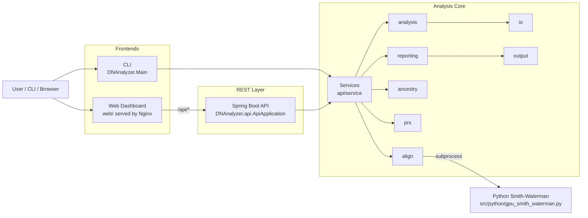
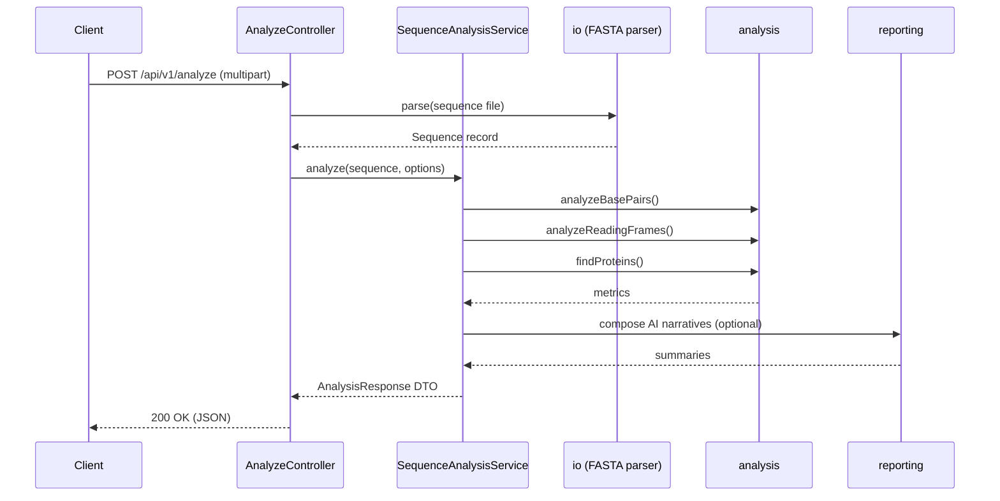
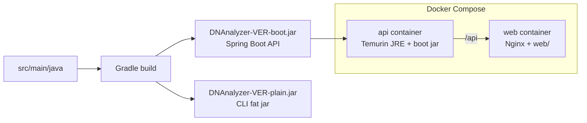
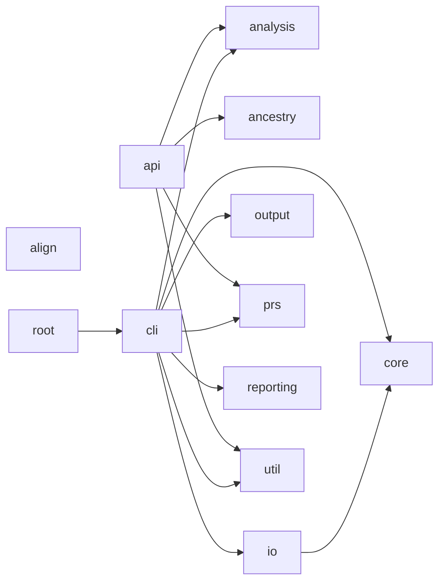
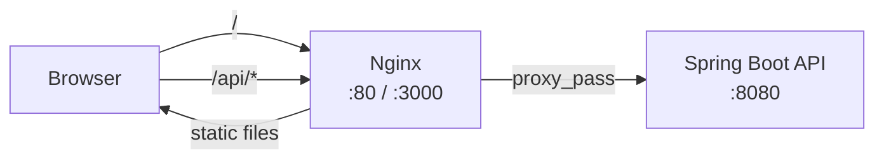

# Architecture

This document explains the moving parts of DNAnalyzer, how they interact, and
where to make changes. Diagrams render as Mermaid on GitHub.

## System overview

DNAnalyzer exposes a shared analysis core through two interfaces. The web
dashboard talks to the REST API over HTTP; the CLI embeds the core directly
in the JVM.

## Component responsibilities

| Component | Source | Responsibility |
|---|---|---|
| CLI | `DNAnalyzer/Main.java`, `DNAnalyzer/cli/` | picocli entry point for batch analysis |
| REST API | `DNAnalyzer/api/` | Spring Boot controllers, DTOs, services |
| Analysis core | `DNAnalyzer/analysis/` | Base-pair counting, reading frames, protein finding |
| Alignment | `DNAnalyzer/align/` | Smith-Waterman wrapper; invokes Python for GPU path |
| Ancestry | `DNAnalyzer/ancestry/` | Continental-origin estimation from 23andMe/AncestryDNA exports |
| PRS | `DNAnalyzer/prs/` | Polygenic-risk-score calculation and per-SNP contribution |
| I/O | `DNAnalyzer/io/` | FASTA, FASTQ, and plain-text parsing |
| Reporting | `DNAnalyzer/reporting/` | Text reports and AI-narrated summaries |
| Output | `DNAnalyzer/output/` | Disk layout for timestamped run directories |
| Core utilities | `DNAnalyzer/core/`, `DNAnalyzer/util/` | Common helpers |
| Python bridge | `src/python/gpu_smith_waterman.py` | PyOpenCL GPU path with pure-Python CPU fallback |

## Request flow: `POST /api/v1/analyze`

## Build and deployment pipeline

## Auto-generated module graph

The block below is produced by `scripts/generate-module-graph.py` from live
package imports in `src/main/java/DNAnalyzer/`. It is refreshed by the
`architecture-sync.yml` GitHub Actions workflow on every push to `main` and
on pull requests that touch `src/main/java/**`. Do not edit the block
manually.

<!-- MODULE-GRAPH:START -->

<!-- MODULE-GRAPH:END -->

## Static frontend

The static web assets live under `web/`. In local development, `open_web_ui`
launches a Python `http.server` for them and points the browser at the
Spring Boot API on `localhost:8080`. In the Docker stack, Nginx
(`nginx.conf`) serves the static files and proxies `/api/*` to the API
container.

## Cross-cutting concerns

- **Security.** OpenSSF Scorecard runs weekly; CodeQL runs on every push
  and PR; DeepSource runs on PRs; GitGuardian scans commits for secrets.
  See [SECURITY.md](../SECURITY.md).
- **Dependency hygiene.** Dependabot opens weekly PRs for Gradle, pip,
  Docker, and GitHub Actions. Third-party actions in security-sensitive
  workflows are pinned to commit SHAs.
- **Observability.** The REST API surfaces `/api/v1/status` for health
  checks. There is no central logging sink; logs are per-process.
- **Privacy guarantee.** No analysis data leaves the host. The optional
  AI report generator calls the configured LLM provider only when an API
  key is present and `--no-ai` is not passed.
