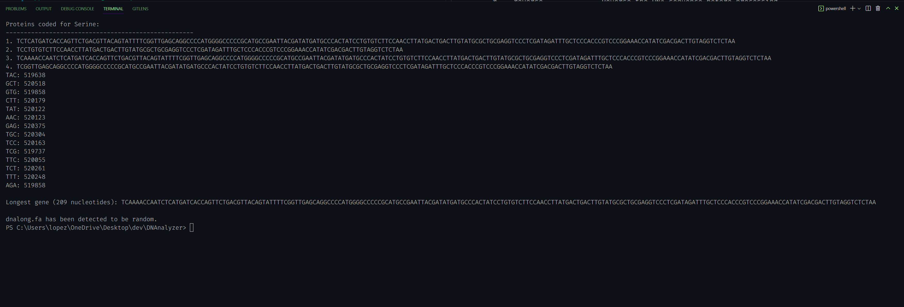
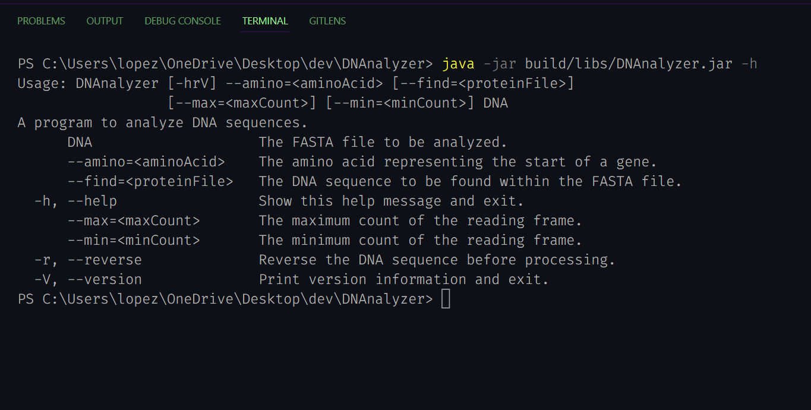

# CLI Arguments - Example

## OS - Specific Build Commands

**IMPORTANT**
* MacOS use `./gradlew build`
* Windows use `.\gradlew build`

1. Type the build command in your terminal depending on your operating system.


2. You should receieve the feedback in your terminal of the successful build.


## Standard CLI Understanding

The CLI consists of two parts.

1. Executable
```java
java -jar build/libs/DNAnalyzer.jar <arguments>
```

2. Arguments
```java
<executable> assets/dna/random/dnalong.fa --amino=ser --min=0 --max=100 -r
```

## Access Help Menu

Use the executable to complete commands.
```java
java -jar build/libs/DNAnalyzer.jar <arguments>
```

To access the help menu type the following command into your terminal.
```java
java -jar build/libs/DNAnalyzer.jar -h
```

You should get the following response:


## Running Example Command

Use the executable to complete commands.
```java
java -jar build/libs/DNAnalyzer.jar <arguments>
```

Type the following into your terminal.
```java
java -jar build/libs/DNAnalyzer.jar assets/dna/random/dnalong.fa --amino=ser --min=14 --max=52
```

You should get the following response:
